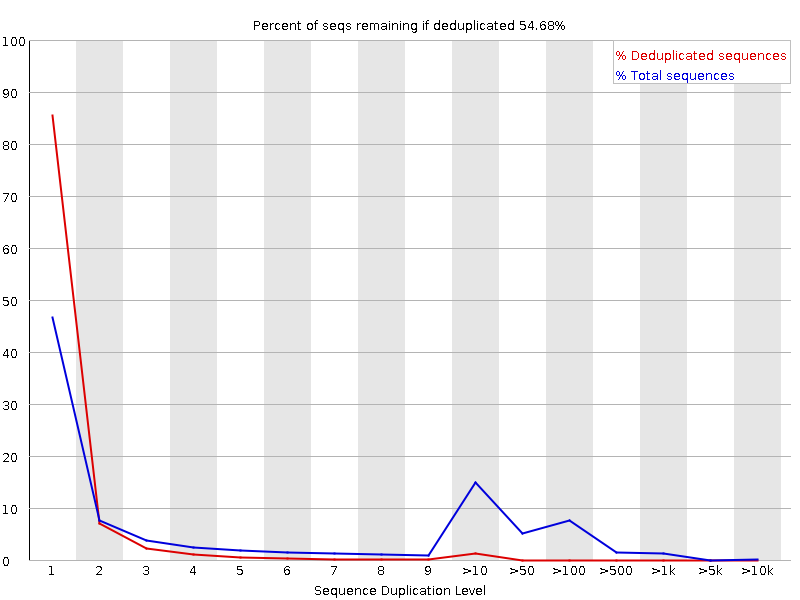
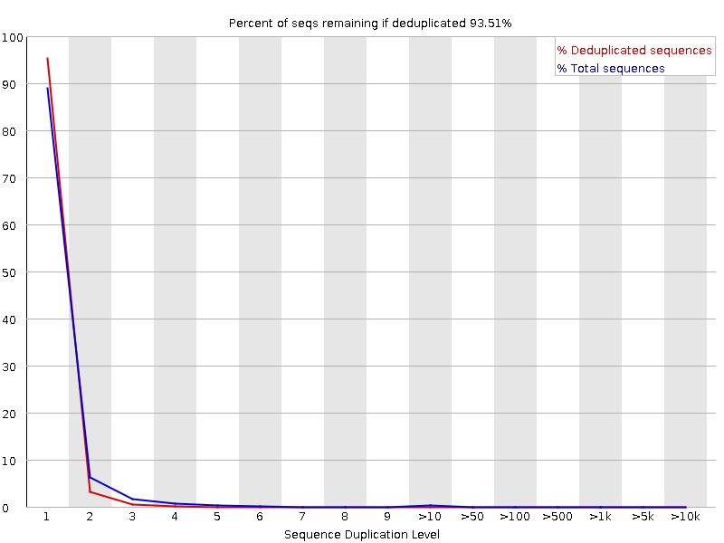

```{r setup, include=FALSE}
knitr::opts_chunk$set(echo = TRUE)
```

## Objective

The goal is to design a script to remove reads from a SAM file which are PCR duplicates. In the SAM file, these are defined as reads with:

* same chromosome ("RNAME")
* same position ("POS"), corrected for soft clipping ("S" in CIGAR string)
* same strand (encoded in "FLAG", bit 16)
* same unique molecular index; "UMI" or "randomer" ("QNAME")

## Files

Located in `./data` (available on Talapas only)

*Input*

* `C1_SE_uniqAlign.sam` - Original input file
* `C1_SE_uniqAlign_sorted.sam` - Input SAM file of uniquely mapped reads (sorted with samtools by chromosome, position, then strand)
* `STL96.txt` - Known UMIs used for this experiment

*Output*

* `C1_SE_uniqAlign_sorted_deduped.sam` - Final SAM file with original SAM file positions without PCR duplicates

## Scripts

* `amcrabtree-deduper.py` - main python script used for removing PCR duplicates
* `Bioinfo.py` - module for high-level functions specific to this workflow

#### High Level Functions 

Located in `Bioinfo.py`

These are the high level functions used in this workflow, imported from `Bioinfo.py`.

* `dice_head()` - Converts SAM line to list of values needed for analysis
* `to_right_pos()` - Converts SAM position with soft clipping (from CIGAR string) to right (genomic 3') position; useful for returning the start position of a reverse complemented read
* `to_true_pos()` - Converts position with soft clipping (from CIGAR string) to true position

## Method

1. The original file (`C1_SE_uniqAlign.sam`) was sorted with `samtools sort` (samtools 1.5
Using htslib 1.5) to obtain a SAM file with the reads listed in order by chromosome, then nucleotide position from 5' to 3' along reference genome (`test_converted.sorted.sam`), then by strand. 

        $ samtools sort /projects/bgmp/shared/deduper/C1_SE_uniqAlign.sam \
          -o C1_SE_uniqAlign_sorted.sam

2. The python script `amcrabtree-deduper.py` converted the sorted SAM file into a file without PCR duplicates. 

- Forward reads only needed to be adjusted for left side soft clipping, while reverse read positions factored in all the other CIGAR string components to calculate the real read start position. See `to_true_pos()` in `Bioinfo.py` for code. 
- Note that reads without recognized UMIs (from UMI input file) were not included in the downstream intermediate file.
- Because neither the `-p` (paired-end) nor the `-r` (single-end reverse reads) flags were selected, this program assumed the library is stranded and in forward orientation. This means it does not write any reverse oriented reads to the output file. 

      $ cd /projects/bgmp/acrabtre/bioinfo/Bi624/deduper/scripts
      $ ./amcrabtree_deduper.py -f ../data/C1_SE_uniqAlign_sorted.sam -u ../data/STL96.txt
            
      Input file: C1_SE_uniqAlign_sorted.sam
      Output file: C1_SE_uniqAlign_sorted_deduped.sam
      Number of header lines: 64
      Number of unique reads (final output): 13719048
      Number of reads with UMI errors: 0
      Number of duplicate reads removed: 4467362

## Results

To determine if PCR duplicates were removed, FastQC (v0.11.5) was run on the original input SAM file and the final output SAM file (Fig. 1). The figure illustrates a decrease in PCR duplicates, as seen by the blue lines. The red lines are hypothetical values calculated by FastQC. 

      $ module load fastqc
      $ cd /projects/bgmp/acrabtre/bioinfo/Bi624/deduper
      $ fastqc /projects/bgmp/shared/deduper/C1_SE_uniqAlign.sam 
      $ fastqc C1_SE_uniqAlign_sorted_deduped.sam 

{width=600, height=400} 

{width=600, height=400} 

**Figure 1.** FastQC sequence duplication levels plots showing PCR duplicates before (top) and after (bottom) `deduper-amcrabtree.sh` was run. 

Additionally, unique read counts, duplicates, unknown UMIs, header lines, and reads per chromosome were recorded in the [Google Sheets](https://docs.google.com/spreadsheets/d/1RSzrI1WNZJcQpX7Pg6fw7dvtpazoOvQ5YJC5zjxBDJM/edit?usp=sharing) document and are listed in Table 1.  

    $ cat C1_SE_uniqAlign_sorted_deduped.sam | grep -v '^@' | awk '{print $3}' | sort | uniq -c

```{r counts_table, echo=FALSE, message=FALSE, warning=FALSE}
library(kableExtra)
counts = read.csv("./data/counts.csv")
colnames(counts)=c("Chromosome","Read Count")
counts %>%
  kbl(caption = "Summary of Chromosome Counts") %>%
  kable_classic(full_width = F, html_font = "Cambria")
```


## Conclusion

Figure 1 shows that the Sequence Duplication Level decreased (blue line) after duplication and that the percent of sequences remaining if duplicates were removed increased from 55% to 93%. The numbers also agreed with those found in the class Google Sheets document. These facts provide strong evidence that the script worked as intended. FastQC has their own algorithm for determining PCR duplicates, which explains why the final number isn't 100%. 
